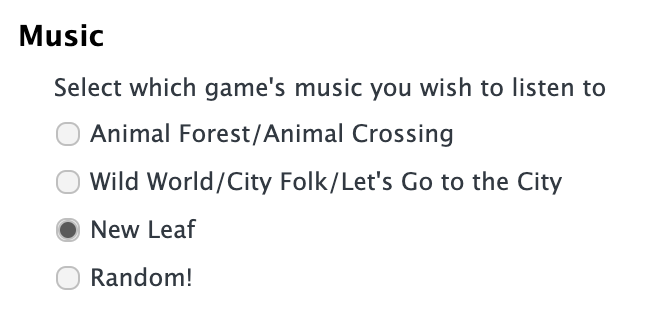
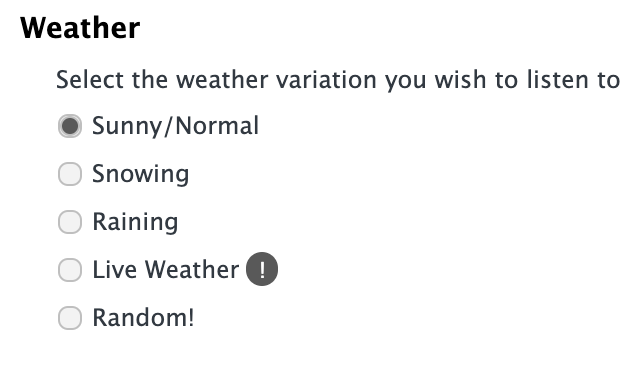
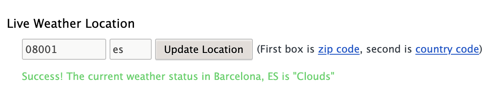
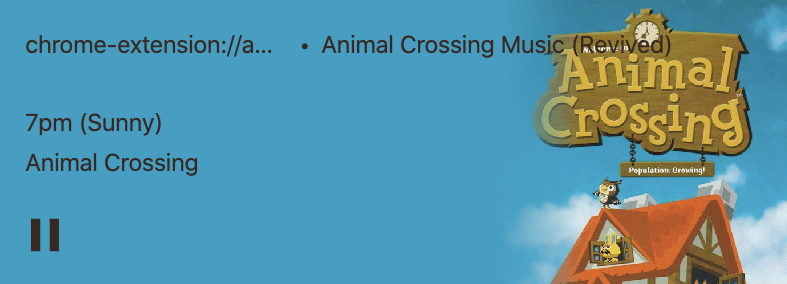
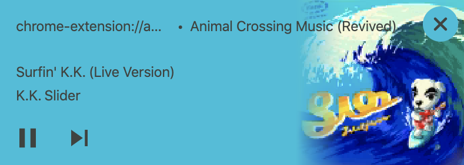
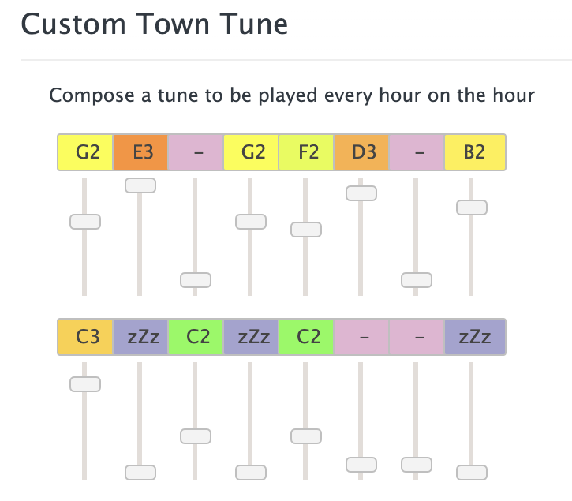

These are all the features this extension provides:
- [Hourly Music](#hourly-music-)
- [Live Weather](#live-weather-)
- [K.K. Slider Tracks](#kk-slider-)
- [Town Tune Editor](#town-tune-)

### Hourly Music 🕒🍀
You will be able to start the extension and inmediately start listening to the hourly background music from the games, updated in real-time with your device clock. 

Featuring music from the following titles:

<ul>
<li>
Animal Crossing
</li>
<li>
Wild World / City Folk
</li>
<li>
New Leaf
</li>
</ul>

### Weather Variants ☔
You may remember that the background hourly music changed slightly on days when it rained or snowed. The extension also features 'raining' and 'snowing' variants of all hourly tracks! 

You can choose which variant you want to listen to, or set it to 'random'.

### Live Weather Support 📍
If you enable the 'Live Weather' option, the extension will use your specified location to detect wheter is sunny, raining,or snowing in your area.

This way, hourly music variants can be automatically picked for you!

### MediaSession Support 💽
Chrome has recently introduced a feature that allows you to control the music playing on your opened tabs.

We have leveraged this new browser feature to display information of the currently playing song. Through the Chrome Media UI you will be able to see the track title, source game and cover!

### K.K. Slider Tracks 🎙☕
You will not be limited to playing just hourly music. 
A big part of the Animal Crossing experience is, undoubtedly, being able to listen to the great K.K. Slider, and this extension will allow you to do just that.

The extension features around **90 tunes** in both their 'live' and 'aircheck' versions. You can choose whether to keep his appearances to the usual Saturday nights, or to play his songs 24/7.

### Town Tune Editor 🔔
Being able to listen to hourly music and have it change automatically is cool and everything, but wouldn't you be missing something if the music just changed from the previous track to the next?

That's right! The extension features an awesome <b>Town Tune</b> composer available within the browser. 

With it you can compone your custom Town Tune, which will be played every time an hour passes – just as in the game!

